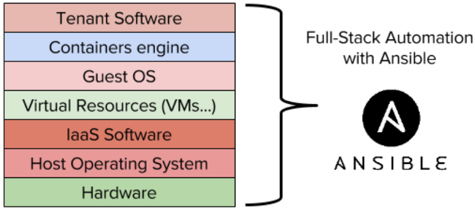

# What's Ansible ?

Ansible is an open-source software provisioning, configuration management, and application-deployment tool. It runs on many Unix-like systems, and can configure both Unix-like systems as well as Microsoft Windows. It includes its own declarative language to describe system configuration.

I am sure it s still confusing in your head but in order to make it easier for you I am going to simplify a bit. Ansible is like shell linux. It's so powerful and could control either the software or hardware of any linux based machine or Windows. However, the difference is that Ansible manages very well its variables. Indeed, Ansible reduce the complexity and also the repeated tasks by making generic and reused variables to factor the common elements of a task. Plus it s using Jinja2 for making dynamic templates of any configurations.

