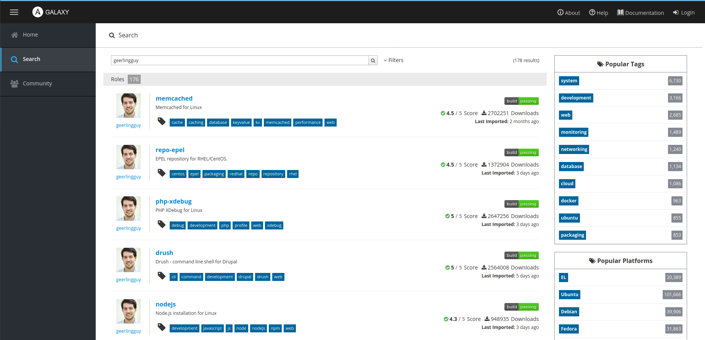

# What is Ansible Galaxy?

Ansible Galaxy is Ansible’s official hub for sharing Ansible content. Before thinking about creating an ansible roles you need to check if there is already the same role on ansible galaxy. Of course the ansible galaxy roles should be well maintained and well documented. On the other hand the same thing should be applied to make your customized roles very easy to use and understandable.

